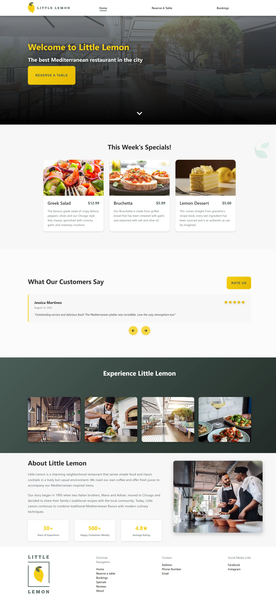
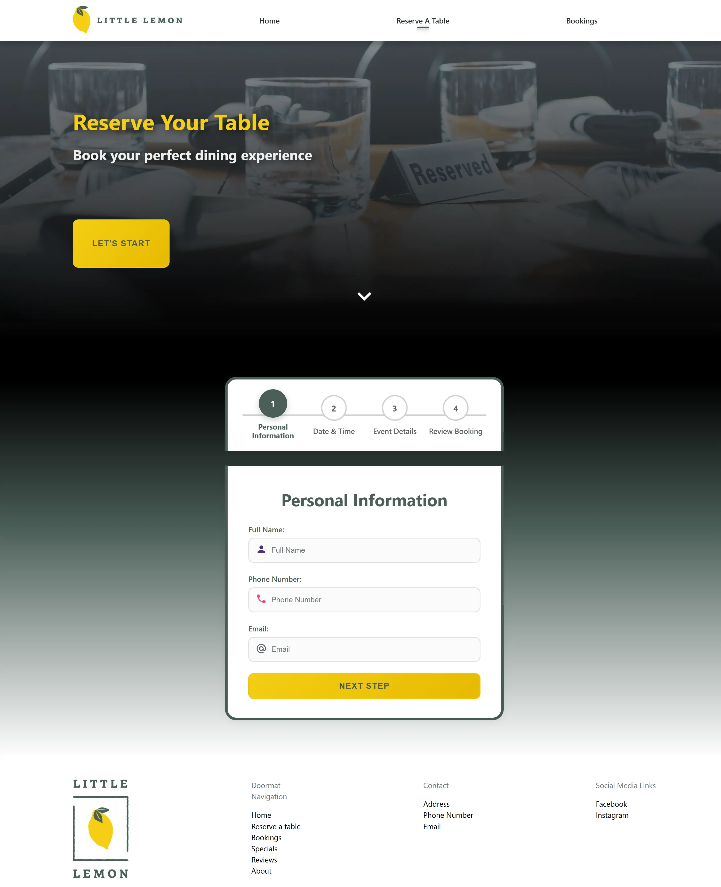
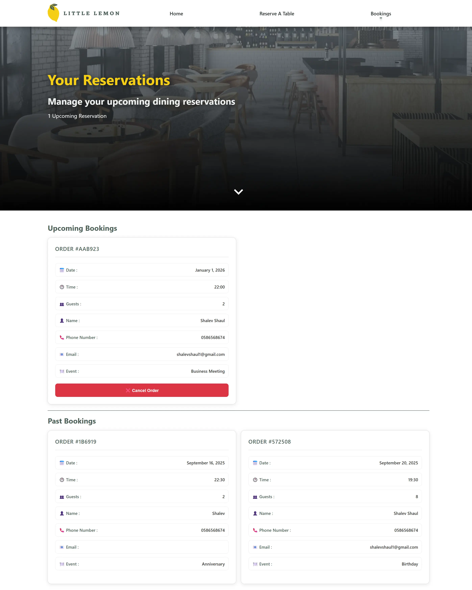

# 🍋 Little Lemon Restaurant
## A modern restaurant website with table reservations built with **React**, **TypeScript**, **Vite**, and **SCSS**.

## 🚀 [Live Demo](https://little-lemon-reserve.vercel.app/)

## 📱 Features

- **Homepage** - Hero, specials, reviews, gallery, about
- **Table Reservations** - Multi-step booking form with validation
- **Booking Management** - View/cancel reservations (max 2 future bookings)
- **Responsive Design** - Works on all devices
- **Smooth Animations** - CSS transitions and scroll effects

## 🎯 Key Technical Features

- **Error Boundaries** - Graceful error handling
- **Custom Hooks** - Reusable logic components
- **SCSS Styling** - Modular styles with variables and nesting
- **Form Validation** - Real-time validation with user feedback
- **Local Storage** - Data persistence without backend
- **Performance Optimized** - Memo, useCallback, useMemo

## 🧠 Business Logic Highlights

- **Smart Reservation System** - Max 2 future bookings per user
- **Conflict Resolution** - Delete existing booking to create new one
- **Date Validation** - No past dates, restaurant hours only
- **Review System** - Add/view customer feedback
- **State Management** - React Context API with custom providers

## 🛠 Tech Stack


## 🏃‍♂️ Quick Start

```bash
# Clone and install
git clone https://github.com/ShalevShaul/little-lemon.git
cd little-lemon
npm install

# Run development server
npm run dev
```

## 📸 Preview

<table>
  <tr>
    <td width="33%" valign="top">
      <h3 align="center">🏠 Home Page</h3>
      
    </td>
    <!--  -->
    <td width="33%" valign="top">
      <h3 align="center">📝 Reservation Page</h3>
      
    </td>
    <!--  -->
    <td width="33%" valign="top">
      <h3 align="center">🍽️ Bookings Page</h3>
      
    </td>
  </tr>
</table>

## 📧 Contact

- 💬 [LinkedIn](https://linkedin.com/in/shalev-shaul-5843772a3)
- 📧 [shalevshaul1@gmail.com](mailto:shalevshaul1@gmail.com)

---

**Built to showcase React/TypeScript skills and modern frontend practices** ⚡